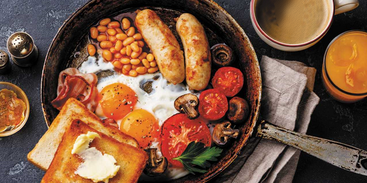

<!doctype html>
<html class="no-js" lang="ru">

<head>
    <meta charset="cp1251">
    <meta http-equiv="x-ua-compatible" content="ie=edge">
    <title> - Главная</title>
    <meta name="description" content="">
    <meta name="viewport" content="width=device-width, initial-scale=1">

    <!-- <link rel="manifest" href="site.webmanifest"> -->
    <link rel="shortcut icon" type="image/x-icon" href="img/favicon.png">
    <!-- Place favicon.ico in the root directory -->

    <!-- CSS here -->
    <link rel="stylesheet" href="css/bootstrap.min.css">
    <link rel="stylesheet" href="css/owl.carousel.min.css">
    <link rel="stylesheet" href="css/magnific-popup.css">
    <link rel="stylesheet" href="css/font-awesome.min.css">
    <link rel="stylesheet" href="css/themify-icons.css">
    <link rel="stylesheet" href="css/nice-select.css">
    <link rel="stylesheet" href="css/flaticon.css">
    <link rel="stylesheet" href="css/gijgo.css">
    <link rel="stylesheet" href="css/animate.css">
    <link rel="stylesheet" href="css/slicknav.css">
    <link rel="stylesheet" href="css/style.css">
    <!-- <link rel="stylesheet" href="css/responsive.css"> -->
</head>

<body>
    <!--[if lte IE 9]>
            
You are using an <strong>outdated</strong> browser. Please <a href="https://browsehappy.com/">upgrade your browser</a> to improve your experience and security.

        <![endif]-->

    <!-- header-start -->
    <header>
        

            

                

                    

                        

                            

                                

                                    <a href="index.html">
                                        
                                    </a>
                                

                            

                            

                                

                                    <nav>
                                        <ul id="navigation">
                                            <li><a class="active" href="index.html">Главная</a></li>
                                            <li><a href="sovet.html">Советы</a></li>
                                            <li><a href="#">Рецепты <i class="ti-angle-down"></i></a>
                                                <ul class="submenu">
                                                    <ul>
<li><a href="index.html">Главная</a></li>
<li><a href="page1.html">Рецепт 1</a></li>
<li><a href="page2.html">Рецепт 2</a></li>
<li><a href="page3.html">Рецепт 3</a></li>
<li><a href="page4.html">Рецепт 4</a></li>
<li><a href="page5.html">Рецепт 5</a></li>
<li><a href="page6.html">Рецепт 6</a></li>
<li><a href="page7.html">Рецепт 7</a></li>
<li><a href="page8.html">Рецепт 8</a></li>
<li><a href="page9.html">Рецепт 9</a></li>
<li><a href="page10.html">Рецепт 10</a></li>
<li><a href="page11.html">Рецепт 11</a></li>
<li><a href="page12.html">Рецепт 12</a></li>
<li><a href="page13.html">Рецепт 13</a></li>
<li><a href="page14.html">Рецепт 14</a></li>
<li><a href="page15.html">Рецепт 15</a></li>
<li><a href="page16.html">Рецепт 16</a></li>
<li><a href="page17.html">Рецепт 17</a></li>
<li><a href="page18.html">Рецепт 18</a></li>
<li><a href="page19.html">Рецепт 19</a></li>
<li><a href="page20.html">Рецепт 20</a></li>
<li><a href="page21.html">Рецепт 21</a></li>
<li><a href="page22.html">Рецепт 22</a></li>
<li><a href="page23.html">Рецепт 23</a></li>
<li><a href="page24.html">Рецепт 24</a></li>
<li><a href="page25.html">Рецепт 25</a></li>
<li><a href="page26.html">Рецепт 26</a></li>
<li><a href="page27.html">Рецепт 27</a></li>
<li><a href="page28.html">Рецепт 28</a></li>
<li><a href="page29.html">Рецепт 29</a></li>
<li><a href="page30.html">Рецепт 30</a></li>
<li><a href="page31.html">Рецепт 31</a></li>
<li><a href="page32.html">Рецепт 32</a></li>
<li><a href="page33.html">Рецепт 33</a></li>
<li><a href="page34.html">Рецепт 34</a></li>
<li><a href="page35.html">Рецепт 35</a></li>
<li><a href="page36.html">Рецепт 36</a></li>
<li><a href="page37.html">Рецепт 37</a></li>
<li><a href="page38.html">Рецепт 38</a></li>
<li><a href="page39.html">Рецепт 39</a></li>
<li><a href="page40.html">Рецепт 40</a></li>
<li><a href="page41.html">Рецепт 41</a></li>
<li><a href="page42.html">Рецепт 42</a></li>
<li><a href="page43.html">Рецепт 43</a></li>
<li><a href="page44.html">Рецепт 44</a></li>
<li><a href="page45.html">Рецепт 45</a></li>
<li><a href="page46.html">Рецепт 46</a></li>
<li><a href="page47.html">Рецепт 47</a></li>
<li><a href="page48.html">Рецепт 48</a></li>
<li><a href="page49.html">Рецепт 49</a></li>
<li><a href="page50.html">Рецепт 50</a></li>
<li><a href="page51.html">Рецепт 51</a></li>
<li><a href="page52.html">Рецепт 52</a></li>
<li><a href="page53.html">Рецепт 53</a></li>
<li><a href="page54.html">Рецепт 54</a></li>
<li><a href="page55.html">Рецепт 55</a></li>
<li><a href="page56.html">Рецепт 56</a></li>
<li><a href="page57.html">Рецепт 57</a></li>
<li><a href="page58.html">Рецепт 58</a></li>
<li><a href="page59.html">Рецепт 59</a></li>
<li><a href="page60.html">Рецепт 60</a></li>
<li><a href="page61.html">Рецепт 61</a></li>
<li><a href="page62.html">Рецепт 62</a></li>
<li><a href="page63.html">Рецепт 63</a></li>
<li><a href="page64.html">Рецепт 64</a></li>
<li><a href="page65.html">Рецепт 65</a></li>
<li><a href="page66.html">Рецепт 66</a></li>
<li><a href="page67.html">Рецепт 67</a></li>
<li><a href="page68.html">Рецепт 68</a></li>
<li><a href="page69.html">Рецепт 69</a></li>
<li><a href="page70.html">Рецепт 70</a></li>
<li><a href="page71.html">Рецепт 71</a></li>
<li><a href="page72.html">Рецепт 72</a></li>
<li><a href="page73.html">Рецепт 73</a></li>
<li><a href="page74.html">Рецепт 74</a></li>
<li><a href="page75.html">Рецепт 75</a></li>
<li><a href="page76.html">Рецепт 76</a></li>
<li><a href="page77.html">Рецепт 77</a></li>
<li><a href="page78.html">Рецепт 78</a></li>
<li><a href="page79.html">Рецепт 79</a></li>
<li><a href="page80.html">Рецепт 80</a></li>
<li><a href="page81.html">Рецепт 81</a></li>
<li><a href="page82.html">Рецепт 82</a></li>
<li><a href="page83.html">Рецепт 83</a></li>
<li><a href="page84.html">Рецепт 84</a></li>
<li><a href="page85.html">Рецепт 85</a></li>
<li><a href="page86.html">Рецепт 86</a></li>
<li><a href="page87.html">Рецепт 87</a></li>
<li><a href="page88.html">Рецепт 88</a></li>
<li><a href="page89.html">Рецепт 89</a></li>
<li><a href="page90.html">Рецепт 90</a></li>
<li><a href="page91.html">Рецепт 91</a></li>
<li><a href="page92.html">Рецепт 92</a></li>
<li><a href="page93.html">Рецепт 93</a></li>
<li><a href="page94.html">Рецепт 94</a></li>
<li><a href="page95.html">Рецепт 95</a></li>
<li><a href="page96.html">Рецепт 96</a></li>
<li><a href="page97.html">Рецепт 97</a></li>
<li><a href="page98.html">Рецепт 98</a></li>
<li><a href="page99.html">Рецепт 99</a></li>
<li><a href="page100.html">Рецепт 100</a></li>
<li><a href="page101.html">Рецепт 101</a></li>
<li><a href="page102.html">Рецепт 102</a></li>
<li><a href="page103.html">Рецепт 103</a></li>
<li><a href="page104.html">Рецепт 104</a></li>
</ul> 
                                                </ul>
                                            </li>
                                            <li><a href="#">blog <i class="ti-angle-down"></i></a>
                                                <ul class="submenu">
                                                    <li><a href="blog.html">blog</a></li>
                                                    <li><a href="single-blog.html">single-blog</a></li>
                                                </ul>
                                            </li>
                                            <li><a href="contact.html">Contact</a></li>
                                        </ul>
                                    </nav>
                                

                            

                            

                                

                                    <a href="#">Book a Table</a>
                                

                            

                            

                                

                            

                        

                    

                

            

        

    </header>
    <!-- header-end -->

    <!-- bradcam_area  -->
    

        

            

                

                    

                        <h3>Рецепты</h3>
                    

                

            

        

    

    <!--/ bradcam_area  -->

    <!--================Blog Area =================-->
    <section class="blog_area section-padding">
        

            

                

                    

                        <article class="blog_item">
                            

                                
                                <a href="#" class="blog_item_date">
                                    <h3>15</h3>
                                    
Jan

                                </a>
                            

                            

                                <a class="list-inline-item" href="single-blog.html">
                                    <h2>ЗА 15 МИНУТ И МЕНЬШЕ</h2>
                                </a>
                                
от закусок и горячих блюд до десертов 
								напитков, от мяса и рыбы до овощей и напитков, рецепты салатов

                                <ul class="blog-info-link">
                                    <li><a href="#"><i class="fa fa-user"></i> Travel, Lifestyle</a></li>
                                    <li><a href="#"><i class="fa fa-comments"></i> 03 Comments</a></li>
                                </ul>
                            

                        </article>

                        <article class="blog_item">
                            

                                
                                <a href="#" class="blog_item_date">
                                    <h3>15</h3>
                                    
Jan

                                </a>
                            

                            

                                <a class="d-inline-block" href="single-blog.html">
                                    <h2>Кулинария, блюда</h2>
                                </a>
                                
Всегда под рукой. Классический рецепт это просто! Что можно приготовить быстро и вкусно. Всегда найдете на этом сайте кулинарии.

                                <ul class="blog-info-link">
                                    <li><a href="#"><i class="fa fa-user"></i> Travel, Lifestyle</a></li>
                                    <li><a href="#"><i class="fa fa-comments"></i> 03 Comments</a></li>
                                </ul>
                            

                        </article>

                        <article class="blog_item">
                            

                                
                                <a href="#" class="blog_item_date">
                                    <h3>15</h3>
                                    
Jan

                                </a>
                            

                            

                                <a class="d-inline-block" href="single-blog.html">
                                    <h2>Рецепт приготовленияНа каждый день</h2>
                                </a>
                                
Юыстрые блюда за 15 минут и меньше. Домашние рецепты

                                <ul class="blog-info-link">
                                    <li><a href="#"><i class="fa fa-user"></i> Travel, Lifestyle</a></li>
                                    <li><a href="#"><i class="fa fa-comments"></i> 03 Comments</a></li>
                                </ul>
                            

                        </article>

                        <article class="blog_item">
                            

                                
                                <a href="#" class="blog_item_date">
                                    <h3>15</h3>
                                    
Jan

                                </a>
                            

                            

                                <a class="d-inline-block" href="single-blog.html">
                                    <h2>От закусок и горячих блюд до десертов и напитков, от мяса и рыбы до овощей и фруктов. Как сократить время на приготовление пищи</h2>
                                </a>
                                
Разберитесь с меню. Рецепт пошагово узнайте здесь. Старайтесь планировать меню заранее - это даст возможность купить все необходимые продукты или заказать их с доставкой, а не бежать в магазин в процессе приготовления пищи. Помимо этого вы сможете планировать и бюджет, ведь получится заранее просчитать расходы на приготовление.

                                <ul class="blog-info-link">
                                    <li><a href="#"><i class="fa fa-user"></i> Travel, Lifestyle</a></li>
                                    <li><a href="#"><i class="fa fa-comments"></i> 03 Comments</a></li>
                                </ul>
                            

                        </article>
                                                <article class="blog_item">
                            

                                
                                <a href="#" class="blog_item_date">
                                    <h3>15</h3>
                                    
Jan

                                </a>
                            

                            

                                <a class="d-inline-block" href="single-blog.html">
                                    <h2>Вкусная еда быстро и просто</h2>
                                </a>
                                
Приготовление вкусных блюд будет Вам в радость.

                                <h3> - Главная</h3>
                                
ЭНЦИКЛОПЕДИЯ БЫСТРЫХ БЛЮД ЗА 15 МИНУТ И МЕНЬШЕ от закусок и горячих блюд до десертов напитков, от мяса и рыбы до овощей и фруктов  Кулинария. Всегда под рукой. Энциклопедии на каждый день Энциклопедия быстрых блюд за 15 минут и меньше. От закусок и горячих блюд до десертов и напитков, от мяса и рыбы до овощей и фруктов  Как сократить время на приготовление пищи  Разберитесь с меню Старайтесь планировать меню заранее - это даст возможность купить все необходимые продукты или заказать их с доставкой, а не бежать в магазин в процессе приготовления пищи. Помимо этого вы сможете планировать и бюджет, ведь получится заранее просчитать расходы на питание.  Имейте запас продуктов в холодильнике Обязательно должны присутствовать овощи, фрукты, колбасы, сыры, масло, молоко, яйца. Если вам нужно будет быстро что-то приготовить, вы сможете сделать бутерброды, сварить молочную кашу или суп - на это вам потребуется не более 15 минут. В выходные, когда у вас есть больше свободного времени, вы можете сделать различные заготовки, которые потом облегчат вам процесс приготовления пищи и сделают его более быстрым. Чтобы тратить меньше времени на приготовление блюд в будни, попробуйте в выходные запастись домашними полуфабрикатами. Например, налепите котлет, заверните блинчики с различной начинкой, сделайте пельмени и вареники и т. д. Заморозьте все в морозильной камере. Придя с работы, вам останется только отварить, пожарить или просто разморозить выбранное блюдо. Если правильно соблюдать все условия хранения, то в замороженном виде полуфабрикаты смогут храниться весьма долго, а вы всю неделю сможете баловать домочадцев вашей вкусной едой, приготовление которой не займет у вас много времени.  Готовьте блюда по уже отработанным кулинарным рецептам Так вы быстрее справитесь со своими хозяйственными хлопотами, ведь вам не придется постоянно сверяться с рецептом. А новые рецепты приберегите для выходных дней, когда вы располагаете большим количеством времени и можете всласть поэкспериментировать. Самый верный способ сэкономить время, которое затрачивается на готовку, - это выбор только тех блюд, приготовление которых занимает не больше 15 минут.  Организуйте рабочее пространство Перед приготовлением пищи кухня должна быть чистой, а стол - свободным. Достаньте из холодильника и из шкафов все, что понадобится в процессе работы, - тогда не придется совершать лишние движения и отвлекаться. Используйте паузы (например, когда вы ждете закипания воды) для ополаскивания посуды, которую вы уже не будете использовать.  ? ?	о	о Пользуйтесь кухонной техникой Чем больше у вас на кухне различных приспособлений типа кухонного комбайна, миксера и прочих, тем больше вы сэкономите времени. Особенно полезны всяческие приспособления для быстрой резки, шинкования, чистки продуктов. Значительно сокращают время современные приборы, например, микроволновка, пароварка, мультиварка. Будет идеально, если они снабжены таймером включения и отключения. Это позволит загружать продукты, выставлять время, а по приходу домой вам останется только подать горячее блюдо к столу. Используя эти рекомендации, за 15 минут на обычной плите, в обычной сковородке или бабушкиной кастрюльке, проявив максимум умения и старания, можно приготовить сказочный обед. Нужно только вложить в процесс готовки душу. Только тогда стоит рассчитывать на похвалы и благодарности.  Бланширование Некоторые продукты перед окончательной тепловой обработкой или замораживанием требуют определенной предварительной подготовки - бланширования. Этот метод блокирует действие ферментов (энзимов) и позволяет сохранить овощи и фрукты свежими, твердыми, снять кожицу или сделать их цвет ярче. Кроме того, бланширование используется для того, чтобы удалить горечь из некоторых овощей и вывести излишек соли из соленой свинины и бекона. Суть метода заключается в ошпаривании продуктов кипятком и быстром погружении в холодную воду. Бланшировать можно и над паром, что лучше сохраняет форму и питательные вещества овощей и фруктов.

                                <ul class="blog-info-link">
                                    <li><a href="#"><i class="fa fa-user"></i> Travel, Lifestyle</a></li>
                                    <li><a href="#"><i class="fa fa-comments"></i> 03 Comments</a></li>
                                </ul>
                            

                        </article>

                        <nav class="blog-pagination justify-content-center d-flex">
                            <ul class="pagination">
                                <li class="page-item">
                                    <a href="#" class="page-link" aria-label="Previous">
                                        <i class="ti-angle-left"></i>
                                    </a>
                                </li>
                                <li class="page-item">
                                    &lt;&lt;&lt;  0  <a href="page1.html">1</a>  <a href="page2.html">2</a>  <a href="page3.html">3</a>  <a href="page4.html">4</a>  <a href="page5.html">5</a>  <a href="page6.html">6</a>  <a href="page7.html">7</a>  <a href="page8.html">8</a>  <a href="page9.html">9</a>  <a href="page10.html">10</a>  <a href="page11.html">11</a>  <a href="page12.html">12</a>  <a href="page13.html">13</a>  <a href="page14.html">14</a>  <a href="page15.html">15</a>  <a href="page16.html">16</a>  <a href="page17.html">17</a>  <a href="page18.html">18</a>  <a href="page19.html">19</a>  <a href="page20.html">20</a>  <a href="page21.html">21</a>  <a href="page22.html">22</a>  <a href="page23.html">23</a>  <a href="page24.html">24</a>  <a href="page25.html">25</a>  <a href="page26.html">26</a>  <a href="page27.html">27</a>  <a href="page28.html">28</a>  <a href="page29.html">29</a>  <a href="page30.html">30</a>  <a href="page31.html">31</a>  <a href="page32.html">32</a>  <a href="page33.html">33</a>  <a href="page34.html">34</a>  <a href="page35.html">35</a>  <a href="page36.html">36</a>  <a href="page37.html">37</a>  <a href="page38.html">38</a>  <a href="page39.html">39</a>  <a href="page40.html">40</a>  <a href="page41.html">41</a>  <a href="page42.html">42</a>  <a href="page43.html">43</a>  <a href="page44.html">44</a>  <a href="page45.html">45</a>  <a href="page46.html">46</a>  <a href="page47.html">47</a>  <a href="page48.html">48</a>  <a href="page49.html">49</a>  <a href="page50.html">50</a>  <a href="page51.html">51</a>  <a href="page52.html">52</a>  <a href="page53.html">53</a>  <a href="page54.html">54</a>  <a href="page55.html">55</a>  <a href="page56.html">56</a>  <a href="page57.html">57</a>  <a href="page58.html">58</a>  <a href="page59.html">59</a>  <a href="page60.html">60</a>  <a href="page61.html">61</a>  <a href="page62.html">62</a>  <a href="page63.html">63</a>  <a href="page64.html">64</a>  <a href="page65.html">65</a>  <a href="page66.html">66</a>  <a href="page67.html">67</a>  <a href="page68.html">68</a>  <a href="page69.html">69</a>  <a href="page70.html">70</a>  <a href="page71.html">71</a>  <a href="page72.html">72</a>  <a href="page73.html">73</a>  <a href="page74.html">74</a>  <a href="page75.html">75</a>  <a href="page76.html">76</a>  <a href="page77.html">77</a>  <a href="page78.html">78</a>  <a href="page79.html">79</a>  <a href="page80.html">80</a>  <a href="page81.html">81</a>  <a href="page82.html">82</a>  <a href="page83.html">83</a>  <a href="page84.html">84</a>  <a href="page85.html">85</a>  <a href="page86.html">86</a>  <a href="page87.html">87</a>  <a href="page88.html">88</a>  <a href="page89.html">89</a>  <a href="page90.html">90</a>  <a href="page91.html">91</a>  <a href="page92.html">92</a>  <a href="page93.html">93</a>  <a href="page94.html">94</a>  <a href="page95.html">95</a>  <a href="page96.html">96</a>  <a href="page97.html">97</a>  <a href="page98.html">98</a>  <a href="page99.html">99</a>  <a href="page100.html">100</a>  <a href="page101.html">101</a>  <a href="page102.html">102</a>  <a href="page103.html">103</a>  <a href="page104.html">104</a>  <a href="page1.html">&gt;&gt;&gt; </a>
                                </li>
                                <li class="page-item">
                                    <a href="#" class="page-link" aria-label="Next">
                                        <i class="ti-angle-right"></i>
                                    </a>
                                </li>
                            </ul>
                        </nav>
                    

                

                

                    

                        <aside class="single_sidebar_widget search_widget">
                            <form action="#">
                                

                                    

                                        <input type="text" class="form-control" placeholder='Search Keyword'
                                            onfocus="this.placeholder = ''"
                                            onblur="this.placeholder = 'Search Keyword'">
                                        

                                            <button class="btn" type="button"><i class="ti-search"></i></button>
                                        

                                    

                                

                                <button class="button rounded-0 primary-bg text-white w-100 btn_1 boxed-btn"
                                    type="submit">Search</button>
                            </form>
                        </aside>

                        <aside class="single_sidebar_widget post_category_widget">
                            <h4 class="widget_title">Рецепты&nbsp;</h4>
                            <ul class="list cat-list">
                                <ul>
<li><a href="index.html">Главная</a></li>
<li><a href="page1.html">Рецепт 1</a></li>
<li><a href="page2.html">Рецепт 2</a></li>
<li><a href="page3.html">Рецепт 3</a></li>
<li><a href="page4.html">Рецепт 4</a></li>
<li><a href="page5.html">Рецепт 5</a></li>
<li><a href="page6.html">Рецепт 6</a></li>
<li><a href="page7.html">Рецепт 7</a></li>
<li><a href="page8.html">Рецепт 8</a></li>
<li><a href="page9.html">Рецепт 9</a></li>
<li><a href="page10.html">Рецепт 10</a></li>
<li><a href="page11.html">Рецепт 11</a></li>
<li><a href="page12.html">Рецепт 12</a></li>
<li><a href="page13.html">Рецепт 13</a></li>
<li><a href="page14.html">Рецепт 14</a></li>
<li><a href="page15.html">Рецепт 15</a></li>
<li><a href="page16.html">Рецепт 16</a></li>
<li><a href="page17.html">Рецепт 17</a></li>
<li><a href="page18.html">Рецепт 18</a></li>
<li><a href="page19.html">Рецепт 19</a></li>
<li><a href="page20.html">Рецепт 20</a></li>
<li><a href="page21.html">Рецепт 21</a></li>
<li><a href="page22.html">Рецепт 22</a></li>
<li><a href="page23.html">Рецепт 23</a></li>
<li><a href="page24.html">Рецепт 24</a></li>
<li><a href="page25.html">Рецепт 25</a></li>
<li><a href="page26.html">Рецепт 26</a></li>
<li><a href="page27.html">Рецепт 27</a></li>
<li><a href="page28.html">Рецепт 28</a></li>
<li><a href="page29.html">Рецепт 29</a></li>
<li><a href="page30.html">Рецепт 30</a></li>
<li><a href="page31.html">Рецепт 31</a></li>
<li><a href="page32.html">Рецепт 32</a></li>
<li><a href="page33.html">Рецепт 33</a></li>
<li><a href="page34.html">Рецепт 34</a></li>
<li><a href="page35.html">Рецепт 35</a></li>
<li><a href="page36.html">Рецепт 36</a></li>
<li><a href="page37.html">Рецепт 37</a></li>
<li><a href="page38.html">Рецепт 38</a></li>
<li><a href="page39.html">Рецепт 39</a></li>
<li><a href="page40.html">Рецепт 40</a></li>
<li><a href="page41.html">Рецепт 41</a></li>
<li><a href="page42.html">Рецепт 42</a></li>
<li><a href="page43.html">Рецепт 43</a></li>
<li><a href="page44.html">Рецепт 44</a></li>
<li><a href="page45.html">Рецепт 45</a></li>
<li><a href="page46.html">Рецепт 46</a></li>
<li><a href="page47.html">Рецепт 47</a></li>
<li><a href="page48.html">Рецепт 48</a></li>
<li><a href="page49.html">Рецепт 49</a></li>
<li><a href="page50.html">Рецепт 50</a></li>
<li><a href="page51.html">Рецепт 51</a></li>
<li><a href="page52.html">Рецепт 52</a></li>
<li><a href="page53.html">Рецепт 53</a></li>
<li><a href="page54.html">Рецепт 54</a></li>
<li><a href="page55.html">Рецепт 55</a></li>
<li><a href="page56.html">Рецепт 56</a></li>
<li><a href="page57.html">Рецепт 57</a></li>
<li><a href="page58.html">Рецепт 58</a></li>
<li><a href="page59.html">Рецепт 59</a></li>
<li><a href="page60.html">Рецепт 60</a></li>
<li><a href="page61.html">Рецепт 61</a></li>
<li><a href="page62.html">Рецепт 62</a></li>
<li><a href="page63.html">Рецепт 63</a></li>
<li><a href="page64.html">Рецепт 64</a></li>
<li><a href="page65.html">Рецепт 65</a></li>
<li><a href="page66.html">Рецепт 66</a></li>
<li><a href="page67.html">Рецепт 67</a></li>
<li><a href="page68.html">Рецепт 68</a></li>
<li><a href="page69.html">Рецепт 69</a></li>
<li><a href="page70.html">Рецепт 70</a></li>
<li><a href="page71.html">Рецепт 71</a></li>
<li><a href="page72.html">Рецепт 72</a></li>
<li><a href="page73.html">Рецепт 73</a></li>
<li><a href="page74.html">Рецепт 74</a></li>
<li><a href="page75.html">Рецепт 75</a></li>
<li><a href="page76.html">Рецепт 76</a></li>
<li><a href="page77.html">Рецепт 77</a></li>
<li><a href="page78.html">Рецепт 78</a></li>
<li><a href="page79.html">Рецепт 79</a></li>
<li><a href="page80.html">Рецепт 80</a></li>
<li><a href="page81.html">Рецепт 81</a></li>
<li><a href="page82.html">Рецепт 82</a></li>
<li><a href="page83.html">Рецепт 83</a></li>
<li><a href="page84.html">Рецепт 84</a></li>
<li><a href="page85.html">Рецепт 85</a></li>
<li><a href="page86.html">Рецепт 86</a></li>
<li><a href="page87.html">Рецепт 87</a></li>
<li><a href="page88.html">Рецепт 88</a></li>
<li><a href="page89.html">Рецепт 89</a></li>
<li><a href="page90.html">Рецепт 90</a></li>
<li><a href="page91.html">Рецепт 91</a></li>
<li><a href="page92.html">Рецепт 92</a></li>
<li><a href="page93.html">Рецепт 93</a></li>
<li><a href="page94.html">Рецепт 94</a></li>
<li><a href="page95.html">Рецепт 95</a></li>
<li><a href="page96.html">Рецепт 96</a></li>
<li><a href="page97.html">Рецепт 97</a></li>
<li><a href="page98.html">Рецепт 98</a></li>
<li><a href="page99.html">Рецепт 99</a></li>
<li><a href="page100.html">Рецепт 100</a></li>
<li><a href="page101.html">Рецепт 101</a></li>
<li><a href="page102.html">Рецепт 102</a></li>
<li><a href="page103.html">Рецепт 103</a></li>
<li><a href="page104.html">Рецепт 104</a></li>
</ul>
                            </ul>
                        </aside>

                        <aside class="single_sidebar_widget tag_cloud_widget">
                            <h4 class="widget_title">Tag Clouds</h4>
                            <ul class="list">
                                <li>
                                    <a href="#">рецепты</a>
                                </li>
                                <li>
                                    <a href="#">блюда</a>
                                </li>
                                <li>
                                    <a href="#">готовим вкусно</a>
                                </li>
                                <li>
                                    <a href="#">что приготовить</a>
                                </li>
                                <li>
                                    <a href="#">домашняя кулинария</a>
                                </li>
                                <li>
                                    <a href="#">как готовить</a>
                                </li>
                                <li>
                                    <a href="#">вкусные рецепты</a>
                                </li>
                                <li>
                                    <a href="#">приготовление</a>
                                </li>
                            </ul>
                        </aside>

                        <aside class="single_sidebar_widget instagram_feeds">
                            <h4 class="widget_title">Instagram Feeds</h4>
                            <ul class="instagram_row flex-wrap">
                                <li>
                                    <a href="#">
                                        
                                    </a>
                                </li>
                                <li>
                                    <a href="#">
                                        
                                    </a>
                                </li>
                                <li>
                                    <a href="#">
                                        
                                    </a>
                                </li>
                                <li>
                                    <a href="#">
                                        
                                    </a>
                                </li>
                                <li>
                                    <a href="#">
                                        
                                    </a>
                                </li>
                                <li>
                                    <a href="#">
                                        
                                    </a>
                                </li>
                            </ul>
                        </aside>

                        <aside class="single_sidebar_widget newsletter_widget">
                            <h4 class="widget_title">Newsletter</h4>

                            <form action="#">
                                

                                    <input type="email" class="form-control" onfocus="this.placeholder = ''"
                                        onblur="this.placeholder = 'Enter email'" placeholder='Enter email' required>
                                

                                <button class="button rounded-0 primary-bg text-white w-100 btn_1 boxed-btn"
                                    type="submit">Subscribe</button>
                            </form>
                        </aside>
                    

                

            

        

    </section>
    <!--================Blog Area =================-->

    <!-- footer_start  -->
    <footer class="footer">
        

            

                

                    

                        

                            

                                <a href="#">
                                    
                                </a>
                            

                            
5th flora, 700/D kings road, green   lane New York-1782  
                                <a href="#">+10 367 826 2567</a>  
                                <a href="#">contact@carpenter.com</a>
                            

                            

                            

                            

                                <ul>
                                    <li>
                                        <a href="#">
                                            <i class="ti-facebook"></i>
                                        </a>
                                    </li>
                                    <li>
                                        <a href="#">
                                            <i class="ti-twitter-alt"></i>
                                        </a>
                                    </li>
                                    <li>
                                        <a href="#">
                                            <i class="fa fa-instagram"></i>
                                        </a>
                                    </li>
                                    <li>
                                        <a href="#">
                                            <i class="fa fa-pinterest"></i>
                                        </a>
                                    </li>
                                    <li>
                                        <a href="#">
                                            <i class="fa fa-youtube-play"></i>
                                        </a>
                                    </li>
                                </ul>
                            

                        

                    

                    

                        

                            <h3 class="footer_title">
                                Useful Links
                            </h3>
                            <ul>
                                <li><a href="#">Menu</a></li>
                                <li><a href="#">About</a></li>
                                <li><a href="#"> Blog</a></li>
                            </ul>
                        

                    

                    

                        

                            <h3 class="footer_title">
                                Subscribe
                            </h3>
                            <form action="#" class="newsletter_form">
                                <input type="text" placeholder="Enter your mail">
                                <button type="submit">Subscribe</button>
                            </form>
                            
Esteem spirit temper too say adieus who direct esteem esteems
                                luckily.

                        

                    

                

            

        

        

            

                

                

                    

                        

                            <!-- Link back to Colorlib can't be removed. Template is licensed under CC BY 3.0. -->
Copyright &copy; All rights reserved | This template is made with <i class="fa fa-heart-o" aria-hidden="true"></i> by <a href="https://colorlib.com" target="_blank">Colorlib</a>
<!-- Link back to Colorlib can't be removed. Template is licensed under CC BY 3.0. -->
                        

                    

                

            

        

    </footer>
    <!-- footer_end  -->

    <!-- JS here -->
    
    
    
    
    
    
    
    
    
    
    
    
    
    
    
    
    
    

    <!--contact js-->
    
    
    
    
    

    
    
</body>
</html>